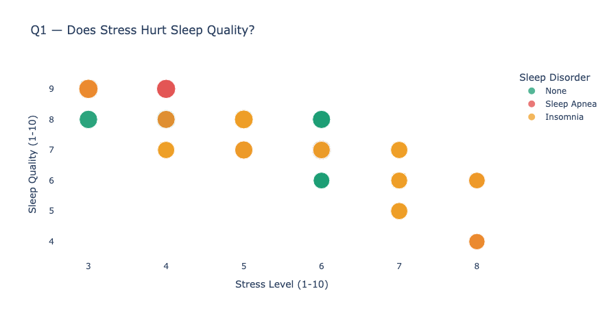
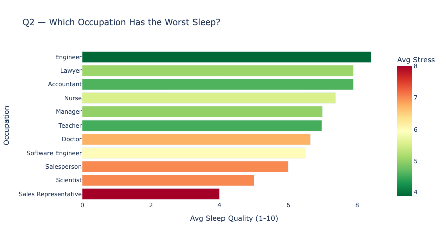
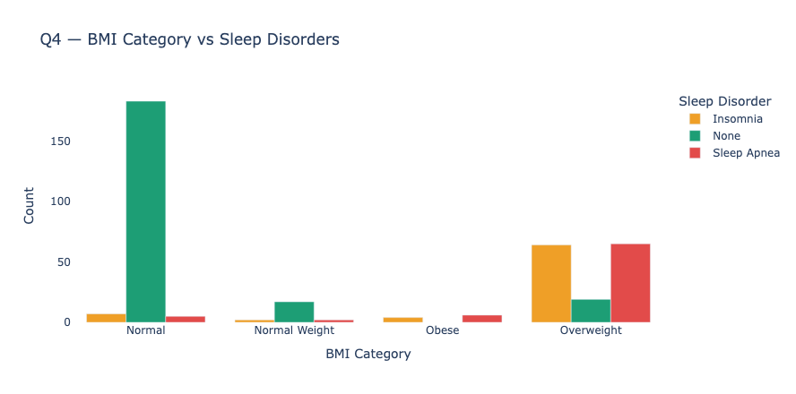
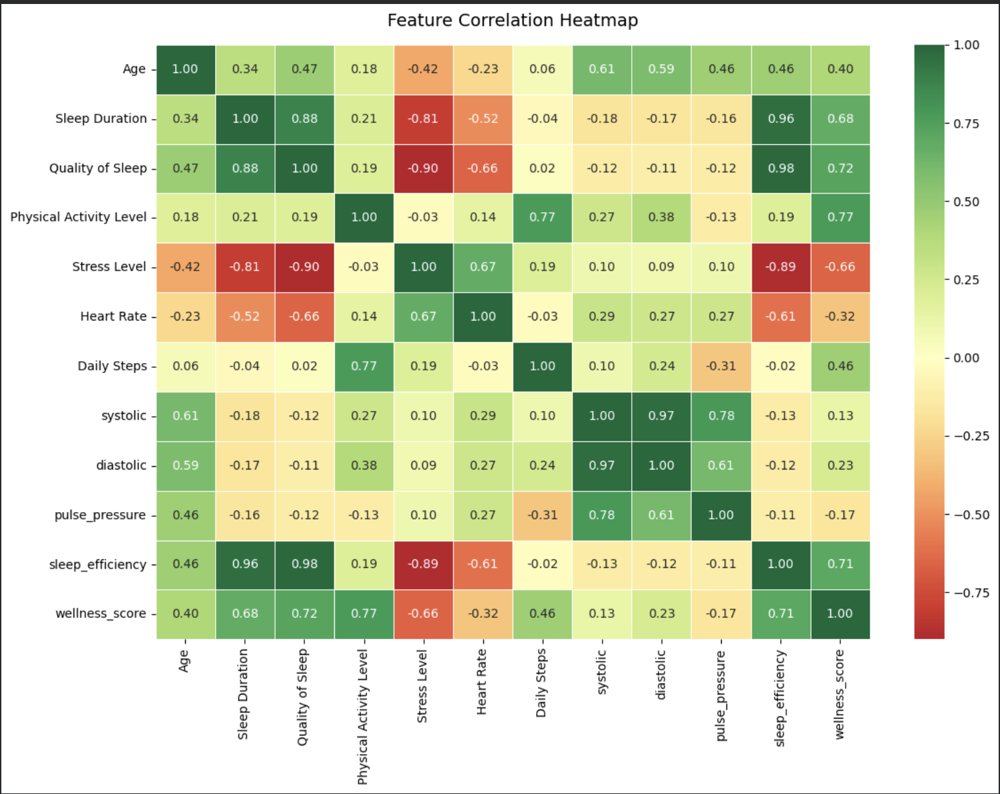
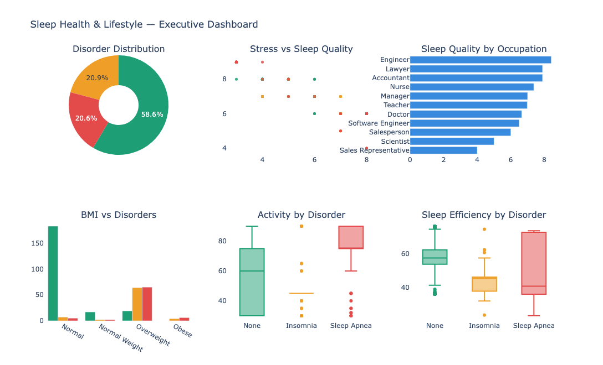

# Sleep Health and Lifestyle — Exploratory Data Analysis

An end-to-end EDA project investigating which lifestyle and physiological factors
drive sleep disorders across 374 patients. Five clinical questions guide the analysis,
each answered with a targeted visualization and a statistical measurement.

---

## The Questions

1. Does stress directly reduce sleep quality?
2. Which occupations produce the worst sleep?
3. Does physical activity protect against sleep disorders?
4. Does BMI category predict disorder type?
5. Do patients with disorders have elevated blood pressure?

---

## Dataset

**Source:** Sleep Health and Lifestyle Dataset — Kaggle  
**Records:** 374 patients, 13 features  
**Target:** Sleep Disorder (None / Insomnia / Sleep Apnea)

| Feature | Type | Notes |
|---|---|---|
| Sleep Duration | Numeric | Average hours per night |
| Quality of Sleep | Numeric | Self-rated 1–10 |
| Stress Level | Numeric | Self-rated 1–10 |
| Physical Activity Level | Numeric | Minutes per day |
| BMI Category | Categorical | Normal / Overweight / Obese |
| Blood Pressure | String | "120/80" — split into systolic and diastolic |
| Occupation | Categorical | 11 job categories |

**One non-obvious fix:** The `Sleep Disorder` column stores NaN for healthy patients.
This is not missing data — it means no disorder. Replacing NaN with "None" is the
first data cleaning step, and getting it wrong would corrupt every downstream analysis.

---

## Engineered Features

Three features were created from existing columns before analysis:

| Feature | Formula | Rationale |
|---|---|---|
| `pulse_pressure` | systolic − diastolic | Force of each heartbeat |
| `sleep_efficiency` | quality × duration | Combined sleep dimension |
| `wellness_score` | activity − stress | Net lifestyle balance |

---

## Key Findings

### 1. Stress correlates with sleep quality at −0.899

The strongest relationship in the dataset. A correlation of −0.899 means stress explains
approximately 81% of the variance in sleep quality scores. This is not a moderate link —
it is close to a direct relationship.



### 2. Occupation predicts sleep quality

Sales Representatives report the worst average sleep quality; Engineers report the best.
The gap reflects chronic stress exposure rather than shift schedules — sales occupations
consistently show the highest stress levels in the dataset.



### 3. Physical activity and sleep disorders

| Sleep Disorder | Avg Activity (min/day) |
|---|---|
| Sleep Apnea | 74.8 |
| None | 57.9 |
| Insomnia | 46.8 |

Insomnia patients are the least active. The direction of causality is unclear from
this data — low activity may worsen insomnia, or insomnia may make activity harder.
The association is present regardless.

### 4. BMI and disorder type follow a clinically recognized pattern

Normal BMI patients are healthy 93.8% of the time. The obese group shows
60% Sleep Apnea prevalence — consistent with the established mechanism where
excess tissue compresses the airway during sleep.



### 5. Blood pressure is elevated in disorder patients

| Group | Systolic | Diastolic |
|---|---|---|
| No disorder | 124.0 | 81.0 |
| Insomnia | 132.0 | 86.9 |
| Sleep Apnea | 137.8 | 92.7 |

Sleep Apnea patients average 137.8/92.7 — above the hypertension threshold of 130/80.
This aligns with known clinical evidence linking untreated sleep apnea to cardiovascular risk.

---

## Correlation with Sleep Quality

```
sleep_efficiency        +0.980
Stress Level            -0.900
Sleep Duration          +0.880
wellness_score          +0.720
Heart Rate              -0.660
Age                     +0.470
Physical Activity        +0.190
pulse_pressure           +0.120
```

Sleep efficiency (quality × duration combined) reaches 0.98 because it is a
composite of two columns that already correlate strongly. The engineered feature
amplifies signal that was already in the data.



---

## Executive Dashboard



---

## How to Run

```bash
pip install kagglehub pandas numpy plotly seaborn matplotlib
jupyter notebook Sleep_Health_EDA.ipynb
```

The dataset downloads automatically via `kagglehub`.

---

## Where to Place Screenshots

After running the notebook, take screenshots of each chart and save them here:

```
sleep-health-eda/
    images/
        stress_vs_sleep.png
        occupation_sleep.png
        bmi_disorders.png
        correlation_heatmap.png
        executive_dashboard.png
    README.md
    Sleep_Health_EDA.ipynb
```

---

## Project Structure

```
Sleep_Health_EDA.ipynb    main notebook (12 sections)
README.md                 this file
images/                   screenshots from notebook output
```

---

* Hasan Akhras*
